## YYText 是如何绘制的


上面的阴影效果是用这样的代码实现的：

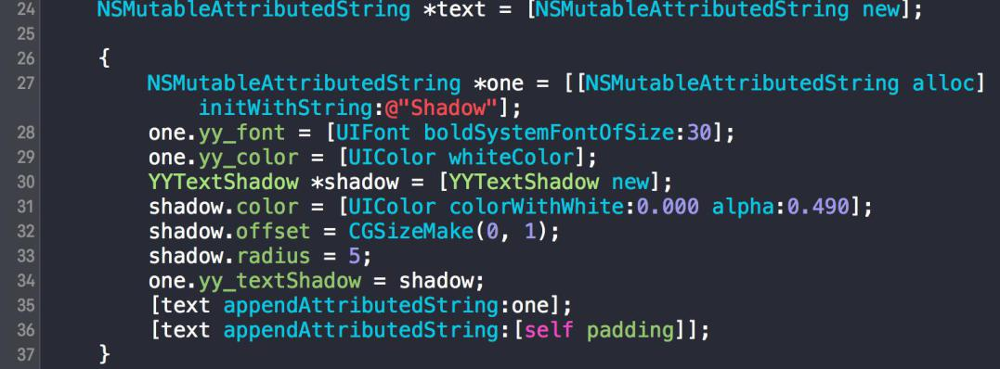


可以看到先生成了 YYTextShadow， 然后赋值给了 attributedString 的 yy_textShadow，然后再把 attributedString 赋值到 YYLabel 里面，接着把 YYLabel 加入到 UIView 里来显示。跟踪 yy_textshadow 发现，主要是把 textShadow 绑定到了 NSAttributedString 的 attribute 里，key 是 `YYTextShadowAttributeName`，值是 textShadow，也就是先把 shadow 存起来，后来再使用。用 Shift + Command + J 快速跳转到定义处：


这里有个 addAttribute，它在 NSAttributedString.h 里

```objc
- (void)addAttribute:(NSString *)name value:(id)value range:(NSRange)range;
```

说你可以赋值任意的键值对给它。而 YYTextShadowAttributeName 的定义是：


一个普通的字符串，说明先是把 shadow 信息存起来，然后后面再使用。我们全局搜索一下`YYTextShadowAttributeName `。

然后我们来到 YYTextLayout 里的 YYTextDrawShadow 函数，


`CGContextTranslateCTM` 是说改变一个 Context 里的原点坐标，所以

```objc
        CGContextTranslateCTM(context, point.x, point.y);
```

是说要把绘制的上下文移动到 point 点。我们还是先搞清楚哪里调用了 YYTextDrawShadow 吧，发现是在：

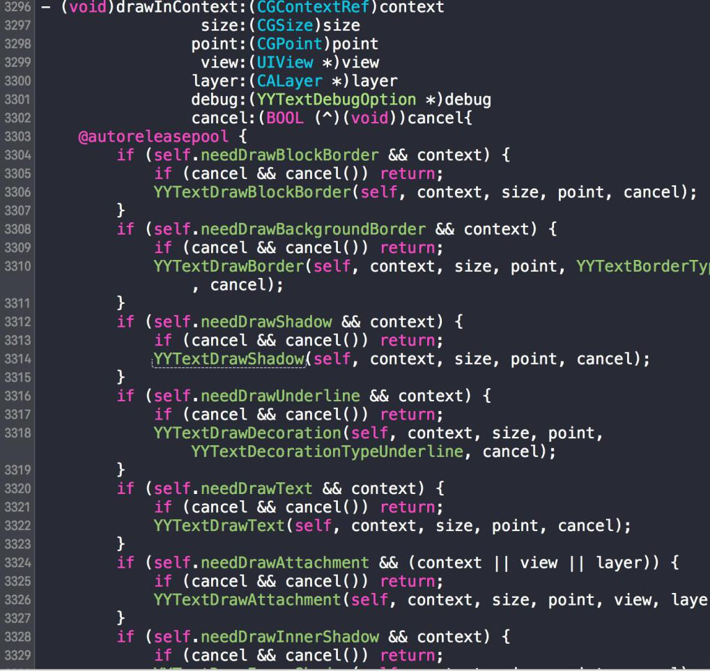


这里可看到，在 drawInContext 里，依次去绘制方块的边框，然后绘制背景边框、阴影、下划线、文字、附属物、内阴影、删除线、文字边框、调试线。

那到底那里用了上面的 drawInContext 呢？我们可以看到里面有个参数 YYTextDebugOption，所以这个函数一定不是系统的回调，而是 YYText 里面自己调用的。

我们按住 Ctrl + 1 弹出快捷键，发现有四个地方调用了它。


上面的 drawInContext:size:debug 可见还是 YYText 自己的调用，因为 debug 的类型是 `YYTextDebugOption *`， 是 YY 自身的，newAsyncTask 不像是系统的调用，addAttachmentToView:layer: 同理，所以极有可能是 drawRect:。

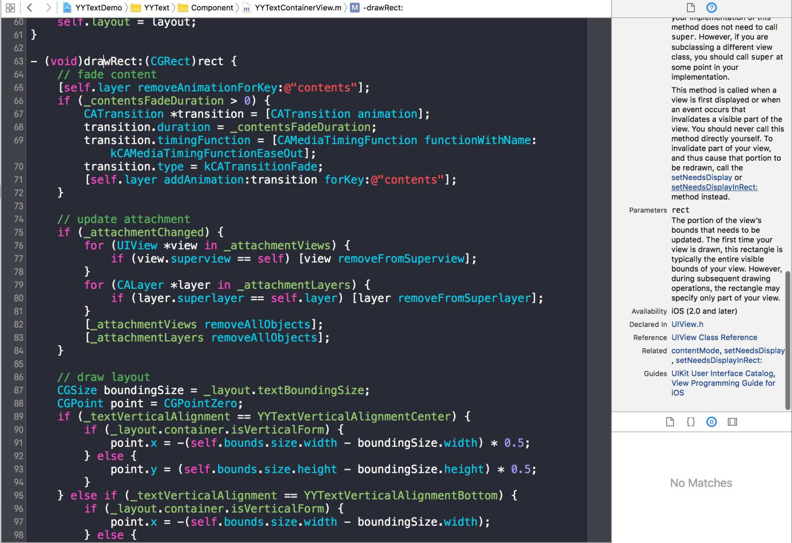

果然是，看右边的快速帮助，有详尽的解释，帮助的下面也说明了是在 UIView 里定义的。再看 YYTextContainerView，它是继承了 UIView 的。

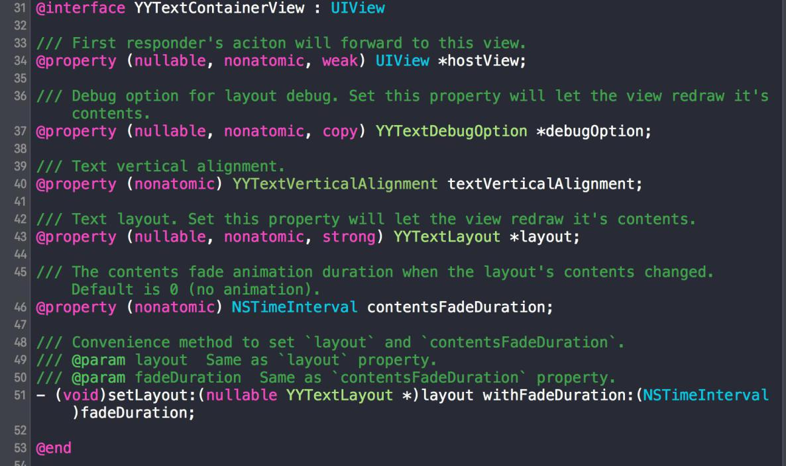

所以 YYLabel 是用了 YYTextContainerView 咯？然后让系统调用 YYTextContainerView 里的 drawRect: 画出来？

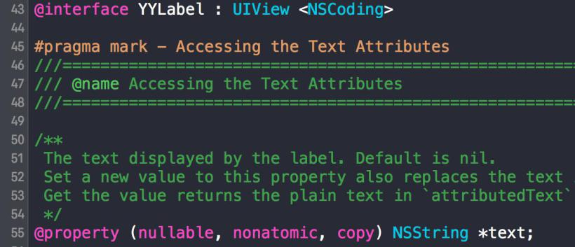

奇怪，YYLabel 可继承了 UIView。所以，YYText 里应该有两套东西！一套 YYLabel，一套 YYTextView，像 UILabel 和 UITextView 一样。接着我们再回去看之前的 YYLabel 的 newAsyncDispalyTask，

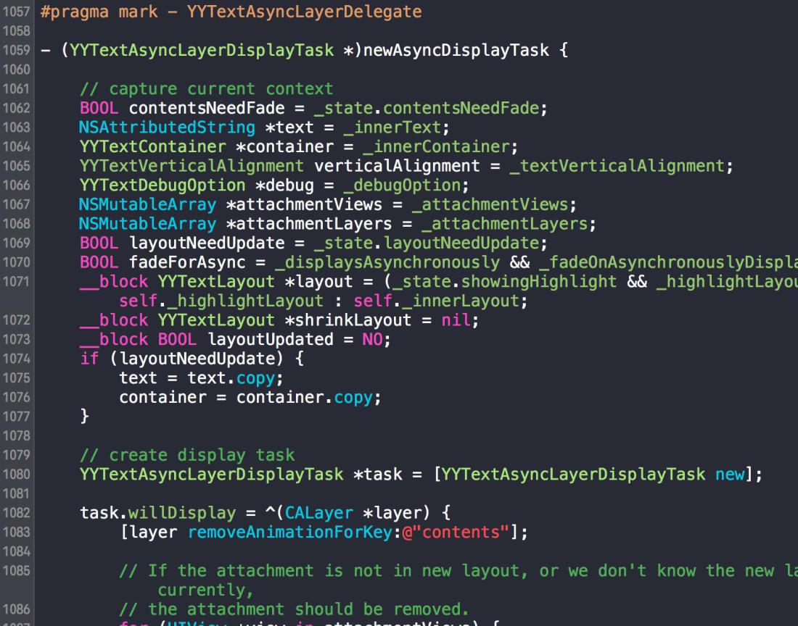

很长，在中间的位置调用了 YYTextLayout 里的 drawInContext。newAsyncDispalyTask，它又是在哪里调用的呢？

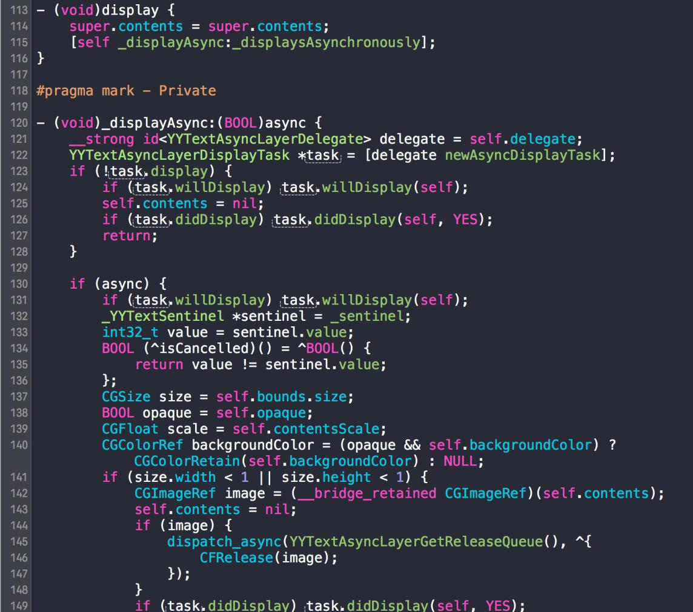

在第二行被调用了。所以可以简单地理解为 YYLabel 用了异步来绘制文本。而 _displayAsync 被上面的 display 调用了。看 display 的文档，说是系统会在恰当的时间来调用来更新 layer 的内容，你不要直接去调用它。我们也可以给它打个断点。


说明这是 display 是在 CALayer 的一次事务中调用的。为何用事务，大概是因为想批量更新，效率高点吧？不像是数据库里的回滚需求。

display 的系统文档还说，如果你想你的 layer 绘制不一样，那你可以复写这个方法，来实现你自己的绘制。

所以，我们简单的有了一点思路。YYLabel 通过复写 UIView 的 display 方法，来异步绘制自己的阴影等各种效果，阴影效果先保存在了 YYLabel 的 attributedText 里的 attribute 中，在 display 中绘制的时候再取出来，绘制的时候用了系统的 CoreGraphics 框架。

所以理清了一些思路后，会发现，真正强大的是什么？一边是把这么多效果、异步调用等组织起来，一边是对底层 CoreGraphics 框架熟练运用。所以对前面的代码组织有了些了解后，接着我们深入到 CoreGraphics 框架上去。看看是怎么绘制上去的。

让我们重新回到 YYTextDrawShadow。


这里，CGContextSaveGState 和 CGContextRestoreGState 包围起了一段绘制的代码。CGContextSaveGState 的意思是说，把当前的绘图状态拷贝一份，放到绘制栈里。每个绘制的 Context 都维护着一个绘制栈。我也不清楚，里面栈到底是怎么操作的。先暂且理解为绘制 Context 前要调用 CGContextSaveGState，绘制 Context 后要调用 CGContextRestoreGState，之后中间的绘制就能有效地出现在 Context 里。CGContextTranslateCTM 是移动到 Context 移动到相应的位置。先是移动到 point.x 和 point.y ，绘制的相应位置，至于后面移动到 0 和 size.height，倒不清楚了，后续再看看。接着取出了 lines，执行了 for 循环。

lines 是什么？发现在 YYTextLayout 里的 `(YYTextLayout *)layoutWithContainer:(YYTextContainer *)container text:(NSAttributedString *)text range:(NSRange)range ` 赋值的。

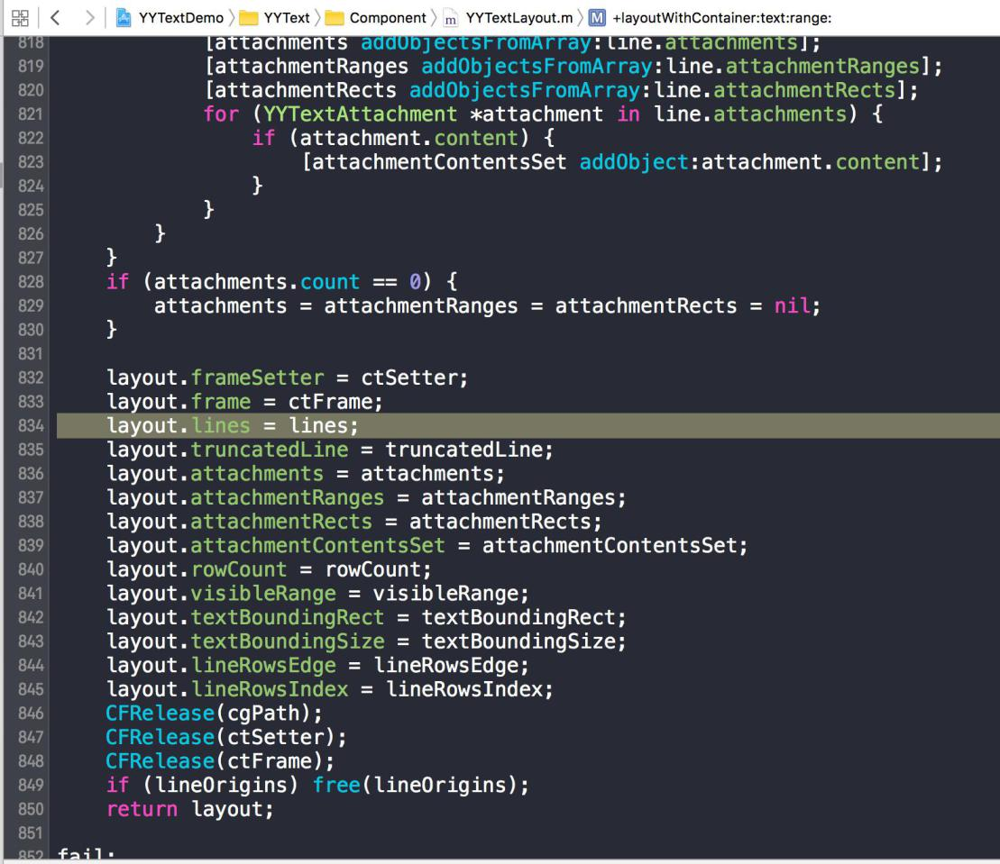

接着翻到这个函数的定义处：

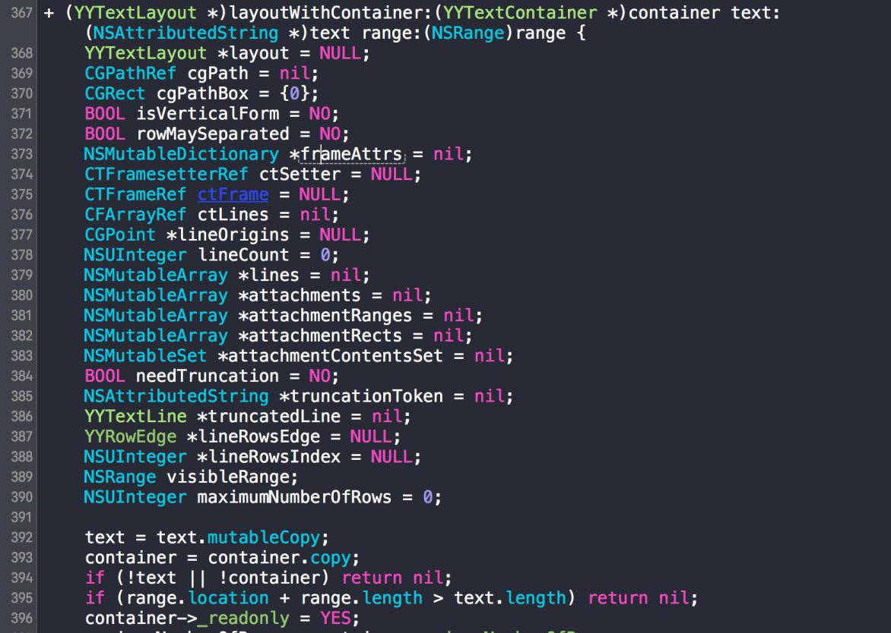

这个函数非常长，367 到 861 行，500 行代码！看了头尾，可见它的用处就是得到这些变量。lines 是怎么得到的呢？

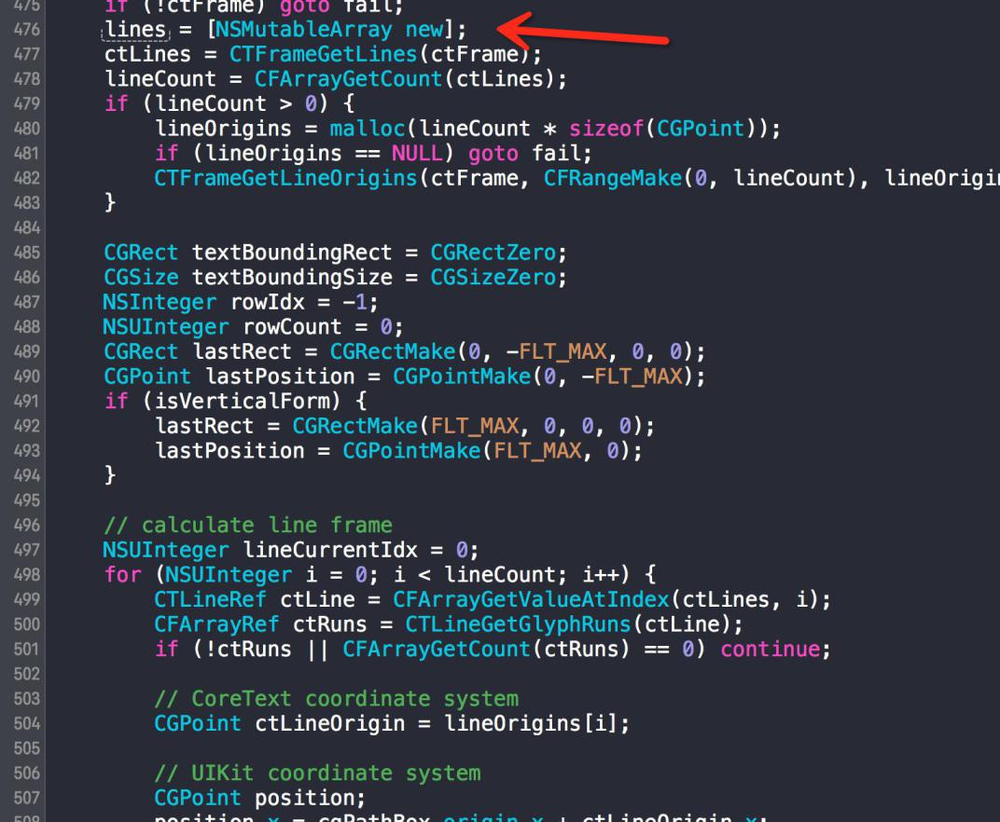

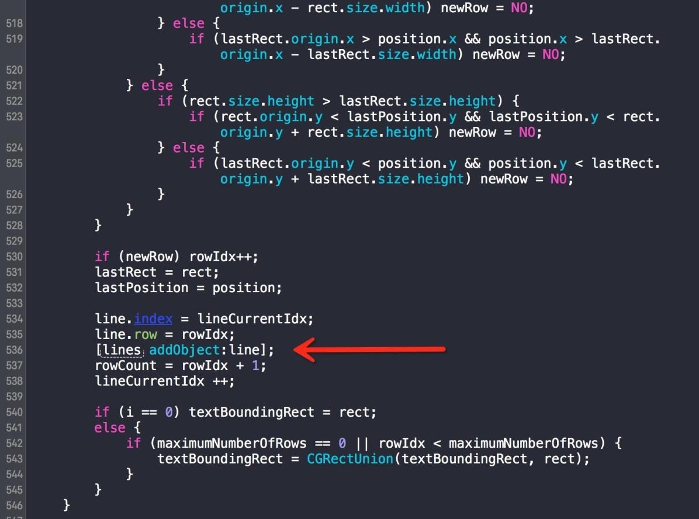

可以见到在一个大的 for 循环里把一条一条 line 加入到 lines 里。那 lineCount 是怎么得到的呢？


第 472 行创建了一个 framesetter 对象，text 参数是 NSAttributedString，接着在 frameSetter 对象中创建了一个 CTFrameRef，接着从 CTFrameRef 得到了 lines。 line 到底是什么呢？我们给它打个断点。

发现，shadow 这个字的 lineCount = 2，并不是我们想象中的字母个数。

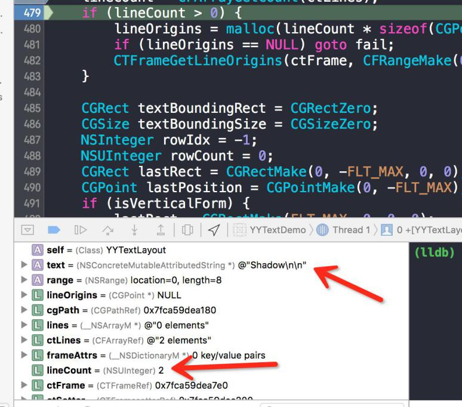

所以猜测，白色的 Shadow 整个是一条 line，阴影也是一条 line？

YYText 里有好几个例子，

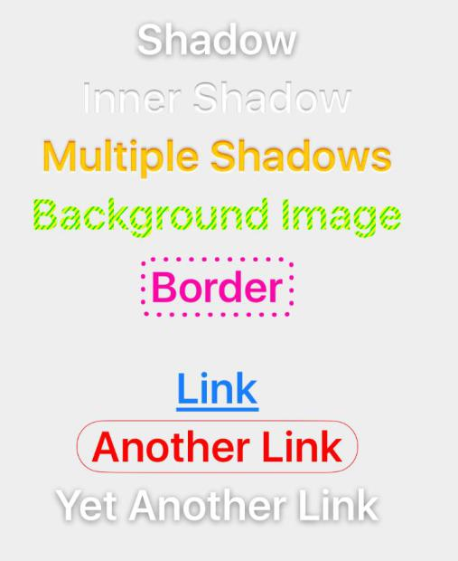

只显示其中一种效果，把其它的代码注释掉。发现很奇怪，Shadow 的 lineCount = 2，Multiple Shadows 的 lineCount 也是 2，可 Multiple Shadows 还有内阴影啊，应该是 3 条啊？

去找 CTLine 的苹果文档，说 CTLine 代表着一行的文本，一个 CTLine 对象包含着一组的 glyph runs。所以就是简单的行数而已！看上面的断点截图，刚刚 shadow 之所以为 2 ，是因为它的文本是 `shadow\n\n`，看刚刚，\n\n 是故意加的，为了显示美观：

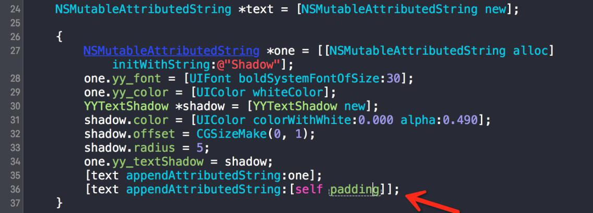


所以 `shadow\n\n` 就是两行文本。CTLine 就是我们平时说的行。接着回去看我们的 lineCount：


这里得到 CTLines 数组，从里面的个数，然后如果 lineCount 大于 0 的话，得到每行的坐标原点。好了，有了 lineCount，我们接着看 for 循环。

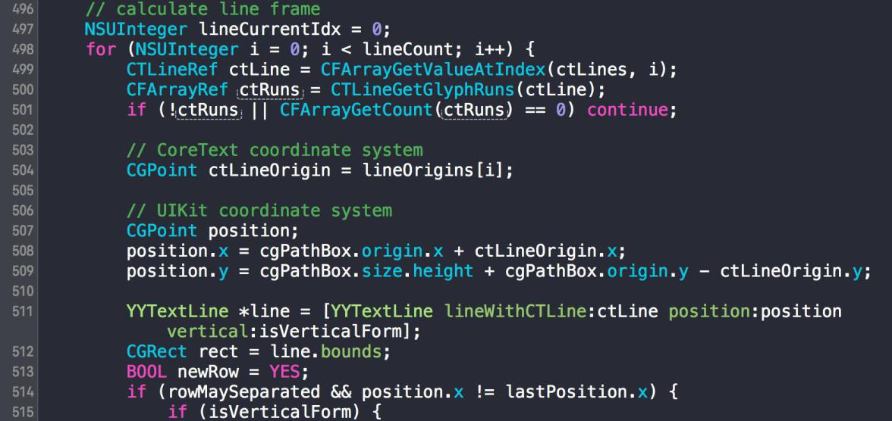

从 ctLines 数组里得到  CTLine，接着得到 YYTextLine 对象，然后加入到 lines 数组中。然后做一些 line 的 frame 计算。YYTextLine 的构造函数很简单，先保存着位置、是否垂直排版、CTLine 对象：


lines 搞清楚之后，我们再回去之前的 YYTextDrawShadow 中去：


这下代码简单了。先获取到行数，遍历它，然后取得 GlyphRuns 数组，再遍历它，GlyphRun 可以理解为一个图元，或者绘制单元。然后从中得到 attributes 数组，用我们之前的 YYTextShadowAttributeName，获取我们一开始赋值的 shadow，接着开始绘制阴影：


一个 while 循环，来不断绘制子阴影。调用 CGContextSetShadowWithColor 设好阴影的位移、半径、颜色。接着调用 YYTextDrawRun 来真正的绘制。YYTextDrawRun 被三个地方调用了：


来绘制内阴影和文本阴影以及文本。说明它是个通用方法，来画 Run 这个对象。

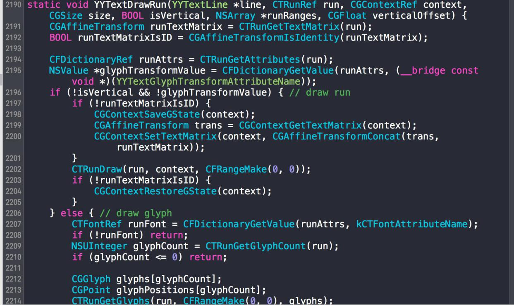

一开始获取文字的变换矩阵，用 runTextMatrixIsID 来看看它是否原地不变，如果不是垂直排版或没有设置图元转换的话，就直接上来画。调用 CTRunDraw 来画 run 对象。接着断点发现，绘制一开始那个阴影时只进入了 if 里面，没有进入 else 里面。

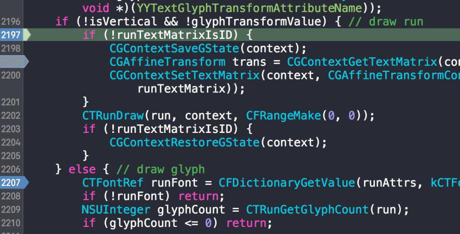

所以我们的阴影绘制就到此结束了！

总结一下，YYLabel 先把阴影等效果保存在 attribtutedText 里的 attrributes，复写了 UIView 的 display 方法，在 display 中进行异步绘制，用 CoreText 框架得到 CTLine、CTRun 对象，从 CTRun 获取到 attributes，之后再根据 attributes 里的各属性，把 CTRun 对象绘制到 Context 中。

理解还是不够，等后续再来品读。不觉感叹 YY 实在太强了！今天理了理思路，让自己边写边读代码，不至于枯燥，同时供大家参考。得去睡觉了~~~~
